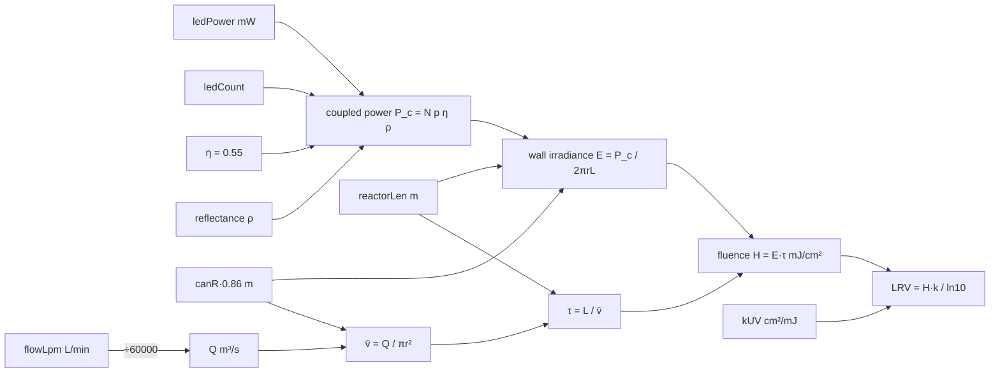

# Dose-budget validation — baseline record (DB-01 to DB-05)

Track B of `validation/backlog.md`. This file is the frozen record: who is
accountable, what the model claims to be, where every dose figure is shown, and the
exact equations, constants and outputs at the baseline revision. It does not judge the
model; that is `model-audit.md`.

Frozen against commit `0605893` on `main`, 2026-09-25.

---

## DB-01 — Accountable owner and independent reviewer

An agent cannot fill this table. It is a human-gate item (AGENT_PLAYBOOK §7: claims
review is never delegated). Until it is filled, nothing in Track B may be quoted as
validation.

| Role | Name | Affiliation | May authorize laboratory work? | Conflict-of-interest declaration | Date |
| --- | --- | --- | --- | --- | --- |
| Validation owner (optical / fluids) | _unassigned_ | | no / yes | | |
| Independent reviewer | _unassigned_ | | no | | |
| Laboratory authorizer (UV-C bench work, DB-48) | _unassigned_ | | yes | | |

Rules recorded with the roles:

- The reviewer must not have written any line of `mask-geometry.js`, `cli.mjs` or the
  metrics cards in `index.html`.
- The laboratory authorizer signs DB-48 before any emitter is energized on a bench.
  No wearable, face-worn or human-exposure test is authorized by anything in this track.
- Conflict-of-interest declarations cover financial interest in PulseMask, Aurelius
  Dynamic, any LED or optics supplier named in the design, and any prior public claim
  about the device's efficacy.

## DB-02 — Status statement

Canonical wording. Every surface in the DB-03 inventory should say this or link to it;
where the current wording differs, the difference is listed in `model-audit.md` and the
change goes through the human claims gate.

> The UV-C dose, mean wall irradiance, reactor dwell time and log-reduction figures
> shown by PulseMask are **exploratory outputs of an unvalidated analytical model**.
> They are computed from nameplate emitter power, an assumed coupling fraction, an
> assumed cavity gain, plug-flow residence time and a literature-style inactivation
> constant with no organism, wavelength or assay reference attached. None of these
> inputs has been measured on a built device. The figures are not measurements, not
> validated performance, and not evidence of protective efficacy against any organism.
> The device is a wearable-art design study, not a respirator, PPE or medical device.

The repository already carries versions of this statement in `CITATION.cff` (lines
35–37), `LICENSE.md` (line 97), `mission.html` (lines 561–574) and the metrics
paragraph of `index.html` (lines 502–505). Those are consistent in spirit; the specific
wording defects are in `model-audit.md` §DB-06.

## DB-03 — Inventory of every surface that presents dose, irradiance, dwell or inactivation

Grep basis: `uvDose|dwellMS|irradiance|mJ/cm|log.?reduction|LRV|kUV|inactivat|dwell`
over `*.html *.md *.mjs *.cff`, excluding `vendor/` and `.worktrees/`.

**Live surfaces** (recompute from the engine on every change):

| Surface | Location | What it shows | Notes |
| --- | --- | --- | --- |
| Engine model | `mask-geometry.js:1139–1146` | the eight-line chain | model of record |
| Engine output keys | `mask-geometry.js:1168–1171` | `dwellMS`, `irradiance`, `uvDose`, `lrv` | consumed by every live surface |
| CLI readout | `cli.mjs:89–90` | "UV-C dose X mJ/cm² (Y% of 3.0 target)", "log reduction X LRV · N LEDs · dwell X ms" | 3.0 target hard-coded |
| CLI warning | `cli.mjs:95–97` | "dose is below the 2-log target … dose ≈ P·η·ρ·r / 2Q" | fires when `uvDose < 3` |
| Metrics card: UV-C dose | `index.html:1065–1067` | value, "target ≥ 3.0 for 2-log", % of target, colour bar | 3.0 hard-coded |
| Metrics card: Log reduction | `index.html:1068–1070` | LRV, "% single-pass inactivation" | **re-implements k as literal `1.2`**, ignores `params.kUV` |
| Metrics card: Reactor dwell | `index.html:1071–1072` | dwell ms, LED count, "mean wall irradiance" | label is correct |
| Golden snapshots | `test/golden-metrics.json:11–14`, `test/golden-cli-output.txt` | baseline numbers | regression net, not a claim surface |

**Static surfaces** (hand-copied numbers; must be edited when the model moves):

| Surface | Location | Figures carried |
| --- | --- | --- |
| Model description | `index.html:502–505` | "N/N₀ = e^(−k·D)", "k ≈ 1.2 cm²/mJ for enveloped RNA virus at 265–280 nm", "55% LED-to-chamber coupling loss", "plug flow … treat the figure as an upper bound" |
| Blower copy | `index.html:1187` | "dwell time is set by the device, not by how hard the wearer breathes" |
| Roadmap card | `index.html:1207` | "close the gap between 0.22 and 3.0 mJ/cm². Bench assay with surrogate phage." |
| Mission page | `mission.html:327–328, 428–434, 506, 561–562, 568, 574` | 0.22 mJ/cm², 3.0 target, 7%, 0.11 LRV, 17 LEDs, 27.6 ms, k ≈ 1.2, "55% LED coupling loss" |
| README | `README.md:23, 96` | 0.22 mJ/cm², ~3 mJ/cm², 7% |
| Citation metadata | `CITATION.cff:35–37` | 0.22 mJ/cm², 3.0 mJ/cm², "two-log" |
| Licence | `LICENSE.md:97` | disclaimer over germicidal / log-reduction figures |
| Handoff | `HANDOFF.md:96–101, 126, 605–608, 663` | parameter table (units), metrics list, dose-gap note, Track 7 target "≥ 3 mJ/cm² at 85 L/min" |
| Playbook | `AGENT_PLAYBOOK.md:82–83, 91–92, 201, 222` | constants list, dose formula, Track 7 target, "0.22 is the honest number" |
| Repo guide | `CLAUDE.md:112–115` | constants list, "0.22 mJ/cm² is the number" |
| Console recipe | `VSCODE.md:89` | prints `uvDose`, `lrv` |
| Print guide | `assembly.html:351, 768` | "not for pathogens" — no figures, disclaimer only |

`guide.html`, `pricing.html`, `shader-lab.html`, `three-d-stage.js` and
`shader-designs.js` carry no dose, irradiance, dwell or inactivation content.

## DB-04 — Frozen baseline

**Revision:** `0605893` (`test: add the golden-metrics regression net`), branch `main`.

**Equations, verbatim from `mask-geometry.js:1139–1146`:**

```js
var rIn = P.canR * 0.86;
var Q = P.flowLpm / 60000;                       // m³/s
var vAir = Q / (Math.PI * rIn * rIn);            // m/s
var dwell = P.reactorLen / vAir;                 // s
var wallCm2 = TAU * (rIn * 100) * (P.reactorLen * 100);
var irr = (P.ledCount * P.ledPower * 0.55 * P.reflectance) / wallCm2;   // mW/cm²
var dose = irr * dwell;                          // mJ/cm²
var lrv = dose * P.kUV / 2.303;
```

**Defaults that feed it (`mask-geometry.js:459–474`):**

| Parameter | Default | Declared range (HANDOFF / UI slider) | Unit |
| --- | --- | --- | --- |
| `canR` | 0.0245 | fixed | m |
| `reactorLen` | 0.028 | 0.018–0.120 | m |
| `ledCount` | 16 (engine) / 17 (CLI and UI, from density 6 per 10 mm × 28 mm) | 4–170 | count |
| `ledPower` | 12 | 4–30 | mW optical per LED (nameplate) |
| `flowLpm` | 85 | 30–120 | L/min |
| `reflectance` | 2.6 | 1–6 | dimensionless cavity gain |
| `kUV` | 1.2 | not exposed | cm²/mJ |

**Constants embedded in the block:** `0.86` (inner radius as a fraction of `canR`),
`0.55` (LED-to-chamber coupling fraction), `2.303` (approximation of ln 10). Per
AGENT_PLAYBOOK §4 none of these is edited by this track.

**Baseline outputs:**

| Case | dwell (ms) | irradiance (mW/cm²) | dose (mJ/cm²) | LRV |
| --- | --- | --- | --- | --- |
| Engine defaults, 16 LEDs | 27.565717 | 7.406872 | 0.204176 | 0.106388 |
| CLI zero-arg, 17 LEDs (what the site quotes) | 27.565717 | 7.869801 | 0.216937 | 0.113037 |

Printed as `0.22 mJ/cm² (7% of 3.0 target)`, `0.11 LRV · 17 LEDs · dwell 27.6 ms`.

**Pinned by:** `test/golden-metrics.json` and `test/golden-cli-output.txt` (engine and
CLI snapshots) plus `test/dose-budget-vectors.json` version 1 (hand-derived vectors).
**Change control:** any edit to the lines above, the defaults, or the three constants
bumps the vector file's `version`, and the PR body explains the delta (playbook §7,
golden-metrics gate).

## DB-05 — Variable and unit map

| Symbol | Code | Input unit | Internal (independent calc) | Dimensions | Meaning |
| --- | --- | --- | --- | --- | --- |
| r | `rIn = canR·0.86` | m | m | L | reactor inner radius |
| L | `reactorLen` | m | m | L | irradiated length |
| Q | `flowLpm / 60000` | L/min | m³/s | L³ T⁻¹ | volumetric flow |
| A | `π r²` | — | m² | L² | flow cross-section |
| v̄ | `Q / A` | — | m/s | L T⁻¹ | mean axial velocity |
| τ | `L / v̄` | — | s (engine reports ms) | T | mean residence time ("dwell") |
| S | `wallCm2 = 2π r L` | — | cm² in engine, m² in independent calc | L² | irradiated wall area |
| N | `ledCount` | count | count | — | emitters |
| p | `ledPower` | mW | W | E T⁻¹ | optical power per emitter |
| η | `0.55` | — | — | — | coupling fraction into the chamber |
| ρ | `reflectance` | — | — | — | cavity gain multiplier |
| P_c | `N p η ρ` | — | W | E T⁻¹ | coupled optical power |
| E | `irr = P_c / S` | — | mW/cm² | E T⁻¹ L⁻² | mean wall irradiance |
| H | `dose = E · τ` | — | mJ/cm² | E L⁻² | fluence ("UV dose"), plug-flow mean |
| k | `kUV` | cm²/mJ | m²/J | L² E⁻¹ | first-order inactivation constant |
| LRV | `dose · kUV / 2.303` | — | — | — | log₁₀ reduction, single pass |

Flow of quantities, with the seams where units change hands:



Two observations the map makes visible, both expanded in `model-audit.md`:

- L enters E in the denominator and τ in the numerator, so it cancels in H. The
  closed form is `H = N p η ρ r / (2Q)`; `HANDOFF.md §8.1` states this correctly.
- The engine changes unit system inside the block (`rIn * 100`, `reactorLen * 100`
  for cm²; L/min ÷ 60000 for m³/s). It is correct today; it is also the only place in
  the chain where a future unit slip would produce a plausible-looking wrong number
  rather than an obvious one.
